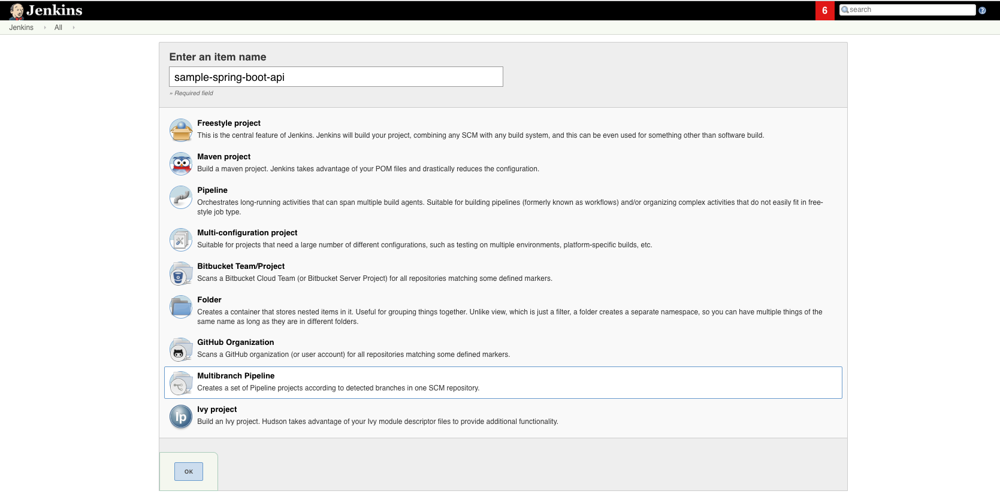

.. _Choose Jenkins Pipeline Type:

------------------------------
Choose a Jenkins Pipeline Type
------------------------------

Now that you have all the services you need running on Docker, you will now be choosing the type of Jenkins pipeline that you will be configuring for a Spring Boot API sample application that we created just for this guide.

To begin, navigate to the homepage of your Jenkins instance.

Click **New Item** on the left-hand menu to create a new Jenkins pipeline. 

For the **Item Name**, enter **sample-spring-boot-api**. Note that the **item name** you give it is arbitrary, 
but for consistency and referencing purposes, we'll be calling it **sample-spring-boot-api**. 

You will see the different types of items you can select from. For more information about which job types you can use currently with the Jenkins
Templating Engine, go here.

For the purposes of this guide, we will be using a **Multibranch Pipeline**, as we will only be configuring a pipeline for a single GitHub repository.
The settings for the new pipeline should look like the following screen:

Click **OK**. You should be taken to a screen to configure your new pipeline. 

The below Gif shows all the things that a user needs to do to continue through this lab as described above.

.. image:: ../images/choose-jenkins-pipeline-type/create_new_item.gif

To use the Jenkins Templating Engine, you will need to configure the configuration section 
labeled Jenkins Templating Engine to specify the Git repository where your pipeline configurations are stored,
the relative path to your Jenkinsfile, and the location of any Git repositories that contain library sources, which are essentially many of the tools that the Solutions Delivery Platform team has created to be already integrated with this platform (i.e. Git, Docker, SonarQube, Twistlock, etc.).
 
If you have been following this guide in order, you will not have already configured a GitHub repository with some pipeline configurations. You will be creating one in the next step.