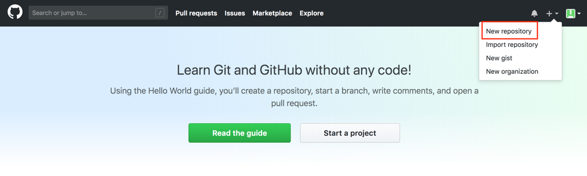

.. _Create Git Repository for a Pipeline Configuration:

-------------------------------------------------------
Create a GitHub Repository for a Pipeline Configuration
-------------------------------------------------------

In this step, you will be creating a GitHub repository that has a pipeline configuration within it. 

The **Pipeline Configuration Repository** is a Git repository where organization-wide settings are configured for your DevSecOps pipelines.
This repository will contain your business organization or project’s configuration file, which specifies the organization-wide libraries you’d like to utilize within the platform, the application environments, your pipeline templates, and more. 

For this example, you will be configuring a pipeline configuration repository that will be able to perform static quality analysis on a tool called SonarQube and to build a Docker image if the given code reaches a certain code quality based on the analysis.

While this example of a pipeline configuration only uses two software tools (Docker and SonarQube), there are many other tools that have been already integrated with SDP. For more information about the libraries that have already been integrated with SDP, go here:

.. code-block:: bash

    https://boozallen.github.io/sdp-pipeline-framework/pages/libraries/index.html

To start, open up a new tab on your browser and then navigate to https://github.com/.

After signing in using your GitHub credentials, you will first create a new repository by going to the upper-hand corner of the screen and clicking the **plus symbol**.
Click the **New repository** option to start creating a repository.

You should now be taken to a screen to **Create a new repository**.
For the repository name, let’s just call it **pipeline-configuration**.
The name of the repository itself is arbitrary, though this name will be referenced in the next section when you specify the settings for your Jenkins pipeline.

You can make it either public or private depending on if you want this repository to be available to the general public.
Do not check the checkbox to initialize the GitHub repository with a README, as you be creating a directory with the right files to push to Git in your computer’s terminal.
You can add a **.gitignore** file if you want and give it the license type you’d like your project to have.

After doing so, you can now click **Create repository**.

You should be taken to a screen describing how you can upload files from your local computer to the GitHub repository.
As you haven’t created any files for the pipeline-configuration repository yet, let’s start there.

Choose a location for your project files, and create a new directory called pipeline-configuration using the command: