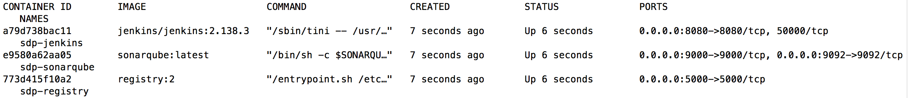

.. _Deploy Devops Tools:
-----------------------
Deploy The DevOps Tools
-----------------------

In this section, you will be deploying all of the DevOps tools that we will be using throughout this tutorial. The following table lists each tool that will be used and their general purpose.

.. csv-table:: Tools to be Deployed
   :header: "**Tool**", "**Description**"

    "`(Insecure) Docker Registry`_", "Server-side application where you can store and retrieve Docker images"
    "`Jenkins`_", "An open-source software tool used for continuous integration for the automation of building and deploying projects"
    "`SonarQube Server`_", "A software tool used to perform automate code analysis for potential security vulnerabilities, bugs, and code smells"

.. _(Insecure) Docker Registry: https://docs.docker.com/registry/
.. _Jenkins: https://jenkins.io/
.. _SonarQube Server: https://www.sonarqube.org/about/

.. note:: The tools that we will be utilizing throughout this tutorial are not fully secure and thus not production-ready. They are meant to just be part of the showcase of what SDP itself can do. 

To begin, clone our SDP-Labs_ GitHub repository, which includes all of the files you'll need to use throughout our guide. 

.. _SDP-Labs: https://github.com/boozallen/sdp-labs

.. code-block:: bash

   ## cloning via ssh
   git clone git@github.com:boozallen/sdp-labs.git
   ## cloning via https
   git clone https://github.com/boozallen/sdp-labs.git

**If you haven't already**, use one of the above commands to clone the repository to your computer. 

In your terminal, navigate to the inside of the ``sdp-labs`` directory that you just cloned from GitHub.

Run the following command in your terminal from the top-level directory of the ``sdp-labs`` directory to deploy the Docker containers using the `provided docker-compose.yaml file`_ within the ``try-it-out`` directory. For some more information about docker-compose files, visit `this page`_.

.. _provided docker-compose.yaml file: https://github.com/boozallen/sdp-labs/blob/master/try-it-out/docker-compose.yaml

.. code-block:: bash

   docker-compose -f ./try-it-out/docker-compose.yaml up --build -d --scale sonar-scanner=0

.. note:: The ``docker-compose`` command run above may not work on a company's WIFI depending on its firewall settings, so you may need to run it on a private network or where firewall rules are more lax. 

.. _this page: https://docs.docker.com/compose/compose-file/

The above command will create and run the following Docker containers: Jenkins, a Docker registry, and SonarQube. To verify this, you can run ``docker ps`` in your terminal. 

The response should show something similar to the following screenshot.

=================================
Register Insecure Docker Registry
=================================

To be able to use and access the Docker registry that you just deployed, you will need to add the Docker registry's IP Address and Port (which should be ``localhost:5000``) to the list of insecure registries found in your Docker Preferences.

Follow the instructions under the section labeled "Deploy a plain HTTP registry" on the following website to do so: https://docs.docker.com/registry/insecure/#deploy-a-plain-http-registry

.. note:: The URL of the Docker registry should **not** be preceded by ``http://`` when being added to the list of insecure registries.

========
Validate
========

Let's verify that you were able to successfully deploy each needed application and that you can access each one.

**Docker Registry**

    Navigate to ``http://localhost:5000/v2/_catalog``. You should see the following screen:

    .. image:: ../images/deploy-devops-tools/docker_registry.png

    If you don't see the above image, go to your computer's terminal running Docker and enter the command ``docker logs sdp-registry`` to determine what may have been misconfigured.

**Jenkins**

    Navigate to ``http://localhost:8080``. You should see the following screen:

    .. image:: ../images/deploy-devops-tools/jenkins.png

    If you don't see the above image, go to your computer's terminal running Docker and enter the command ``docker logs sdp-jenkins`` to determine what may have been misconfigured.

**SonarQube Server**

    Navigate to ``http://localhost:9000``. You should see the following screen:

    .. image:: ../images/deploy-devops-tools/sonarqube.png

    If you don't see the above image, go to your computer's terminal running Docker and enter the command ``docker logs sdp-sonarqube`` to determine what may have been misconfigured.
